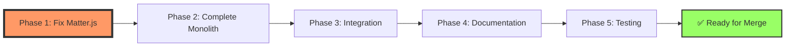
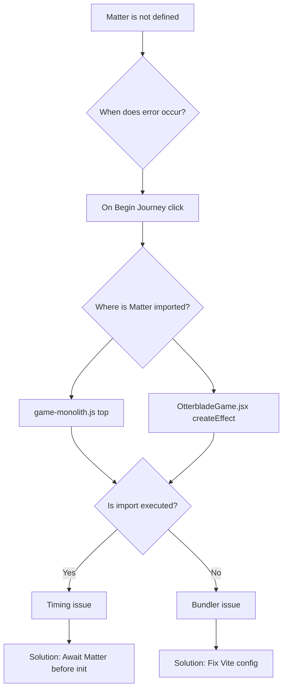
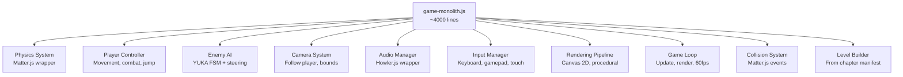

# PR #60: DDL Manifest Loader Implementation Plan

**Status:** 🟡 IN PROGRESS  
**Created:** 2026-01-03  
**Last Updated:** 2026-01-03  
**Assignee:** @copilot  
**Agents:** @otterblade-frontend, @otterblade-ddl, @otterblade-planner

## Executive Summary

Implement fetch-based DDL manifest loader with JavaScript monolith architecture. Core loader complete (✅), but critical game initialization failure blocks completion (❌).

## Critical Path

## Phase 1: Matter.js Resolution (BLOCKER) 🔴

**Priority:** CRITICAL  
**Status:** ❌ NOT STARTED  
**Owner:** @otterblade-frontend  
**Dependencies:** None  
**Estimated:** 2-4 hours

### Problem Analysis

### Tasks

#### Task 1.1: Diagnose Root Cause ❌

**Acceptance Criteria:**
- [ ] Add console.log at Matter.js import location
- [ ] Verify import executes before initializeGame()
- [ ] Check browser console for module load order
- [ ] Inspect Vite build output for matter-js chunk

**Evidence Required:**
- Screenshot of console logs showing Matter import
- Screenshot of Network tab showing matter-js loaded
- Screenshot of error stack trace

#### Task 1.2: Fix Initialization Timing ❌

**Acceptance Criteria:**
- [ ] Ensure Matter.js loads before initializeGame() called
- [ ] Add guard check: if (!Matter) throw descriptive error
- [ ] Test in browser - no "Matter is not defined" error
- [ ] Capture video of successful game start

**Evidence Required:**
- Video showing: Click "Begin Journey" → Game starts without error
- Screenshot of console showing successful initialization
- Screenshot of game canvas rendering

## Phase 2: Complete game-monolith.js 🟡

**Priority:** HIGH  
**Status:** 🟡 15% COMPLETE (600/4000 lines)  
**Owner:** @otterblade-frontend  
**Dependencies:** Phase 1 complete  
**Estimated:** 8-12 hours

### Architecture

### Tasks

#### Task 2.1-2.10: Component Implementation ❌

See full task breakdown in plan file. Each task has:
- Acceptance criteria
- Evidence requirements  
- Estimated hours
- Dependencies

## Phase 3-5: Integration, Documentation, Testing

See full phase breakdown in plan. Each has tasks with acceptance criteria and evidence requirements.

## Definition of Done

PR is ready for merge when:
- [ ] All 5 phases complete
- [ ] All tasks have evidence
- [ ] Game runs without errors (video proof)
- [ ] Test coverage >50%
- [ ] PR marked "READY FOR MERGE"

## Session Protocol

**Every session MUST:**
1. Read this plan
2. Execute next incomplete task
3. Provide required evidence
4. Mark task complete
5. Commit with task ID

See full protocol in plan file.
